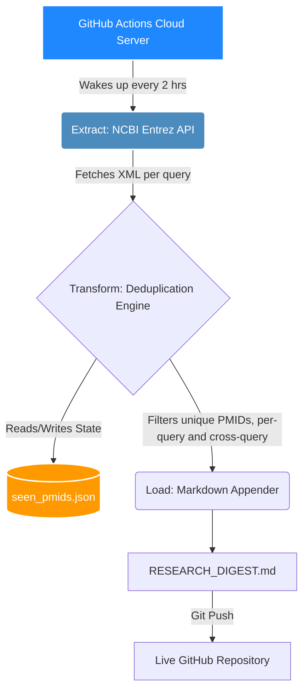

<div align="center">
  
</div>

<h2 align="center">🧬 Intelligent Literature Extraction & Deduplication Engine</h2>

<p align="center">
  
  
  
  
</p>

---

## 🔬 System Overview

Keeping pace with the rapid volume of publications in computational biology, drug discovery, and immunoinformatics is overwhelming. **PubMed Automator** is a serverless, autonomous ETL (Extract, Transform, Load) pipeline that acts as a relentless research assistant.

It automates the literature review process by querying the NCBI database, parsing XML responses, eliminating duplicates via persistent state tracking, and appending newly discovered papers to a running markdown digest — all on a schedule, with zero manual intervention.

### ✨ Core Features
* **⏱️ Cron-Scheduled Automation:** Executes automatically every 2 hours via GitHub Actions.
* **🧠 Intelligent Deduplication:** Uses a persistent JSON hash-set (`seen_pmids.json`) — committed back to the repo every run — to remember processed literature and prevent redundant reprocessing, including across overlapping queries within the same run.
* **🎯 Precision Queries:** Configured across six bioinformatics-adjacent search terms: *Computational Drug Discovery, Machine Learning in Drug Discovery, Deep Learning in Drug Discovery, Molecular Docking, Immunoinformatics,* and *Genomics Transcriptomics*.
* **📑 Markdown Digest:** New discoveries are appended to `RESEARCH_DIGEST.md` under a timestamped section header each run — full history is preserved, newest section at the bottom.

---

## 🏗️ Pipeline Architecture



---

## 📂 Project Structure

```
pubmed_tracker/
├── fetch_papers.py                       # Core ETL script
├── requirements.txt                      # biopython==1.87, numpy==2.2.6
├── seen_pmids.json                       # Persistent dedup state (committed, not gitignored)
├── RESEARCH_DIGEST.md                    # Append-only running digest
├── .gitignore
└── .github/workflows/paper_tracker.yml   # Scheduled automation
```

---

## ⚙️ How It Works

1. **Load state** — `load_seen_pmids()` reads `seen_pmids.json` into a Python set for instant lookup. First run starts with an empty set.
2. **Search** — `search_pubmed(query)` hits NCBI's `esearch` endpoint per query and returns a list of PMIDs.
3. **Filter** — new PMIDs for that query are computed by excluding anything already in `seen_pmids`. Found PMIDs are marked seen **immediately**, before moving to the next query — this prevents the same paper matching two overlapping queries (e.g. "molecular docking" and "computational drug discovery") from being processed twice in a single run.
4. **Fetch details** — `fetch_paper_details(pmid_list)` hits `efetch` and parses title + abstract for every new PMID found.
5. **Append to digest** — `append_to_markdown()` writes a new timestamped section to `RESEARCH_DIGEST.md` in append mode, so prior history is never touched or overwritten.
6. **Save state** — `save_seen_pmids()` writes the updated set back to disk, so the next scheduled run — which starts from a fresh checkout — knows what's already been processed.

> **Note on ordering:** the digest is append-only, so newest discoveries land at the **bottom** of the file, oldest at the top. This is a deliberate v1 scope choice, not a bug — reversing that would mean rewriting the whole file each run instead of appending.

> **Note on scope:** there's no structured `data/papers.json` dataset in this version — `seen_pmids.json` only stores IDs for dedup, not full paper records. The markdown digest is the only historical record. This is intentional for v1.

---

## 🚀 Setup Guide

### Phase 1: Local Setup

```bash
mkdir pubmed_tracker && cd pubmed_tracker
git init

python3 -m venv venv
source venv/bin/activate   # Windows: .\venv\Scripts\activate

pip install biopython
pip freeze > requirements.txt
```

### Phase 2: Configure your NCBI email

`fetch_papers.py` currently sets your email directly:

```python
Entrez.email = "your_email@example.com"
```

NCBI requires a real contact email on every API request so they can reach you if a script misbehaves — this is required, not optional. Replace the placeholder with your own address before running.

> ⚠️ Since this is hardcoded rather than pulled from an environment variable, it will be visible in plaintext to anyone who views this public repository. If that's a concern, the fix later is to switch to `os.environ.get("ENTREZ_EMAIL")` and pass it in via a GitHub Actions secret — noted here as a known follow-up, not required for v1.

**Test locally:**

```bash
python3 fetch_papers.py
```

Run it once — it should create `seen_pmids.json` and `RESEARCH_DIGEST.md`. Run it again immediately — every query should print "No new papers found."

### Phase 3: `.gitignore`

```
venv/
__pycache__/
*.pyc
```

**Do not** add `seen_pmids.json` or `RESEARCH_DIGEST.md` here — both need to be committed. GitHub Actions checks out a fresh copy of the repo on every scheduled run; if the state file isn't tracked in git, deduplication silently resets to zero every run.

### Phase 4: GitHub Actions

```bash
mkdir -p .github/workflows
```

Create `.github/workflows/paper_tracker.yml`:

```yaml
name: PubMed Tracker Pipeline

# Trigger the workflow automatically every 2 hours and allow manual clicks
on:
  schedule:
    - cron: '0 */2 * * *'
  workflow_dispatch:

# Grant the bot permission to save the files back to your repo
permissions:
  contents: write

jobs:
  run-pipeline:
    runs-on: ubuntu-latest

    steps:
      - name: Checkout Repository
        uses: actions/checkout@v4

      - name: Setup Python
        uses: actions/setup-python@v5
        with:
          python-version: '3.10'

      - name: Install Dependencies
        run: |
          python -m pip install --upgrade pip
          pip install -r requirements.txt

      - name: Execute Pipeline
        run: python fetch_papers.py

      - name: Commit and Push Changes
        run: |
          git config --global user.name "github-actions[bot]"
          git config --global user.email "github-actions[bot]@users.noreply.github.com"
          git add RESEARCH_DIGEST.md seen_pmids.json
          git diff --staged --quiet || git commit -m "Auto-update PubMed digest [skip ci]"
          git push
```

### Phase 5: Push and Configure Permissions

```bash
git remote add origin https://github.com/AbdulRaffayQureshi/pubmed_tracker.git
git branch -M main
git push -u origin main
```

Then in the repo on GitHub:

1. **Settings ⚙️ → Actions → General → Workflow permissions** → select **Read and write permissions** → Save. Without this, the bot can check the code out but can't push the digest back.
2. **Actions tab** → select "PubMed Tracker Pipeline" → **Run workflow** to trigger it manually and confirm end-to-end before relying on the 2-hour schedule.

---

## 🗺️ Known v1 Scope / Possible Follow-ups

These are deliberate scope decisions for this version, not bugs — listed here so future-you (or anyone reading this repo) knows they were considered, not missed:

- **Append-only digest** — newest entries at the bottom. Switching to newest-on-top would require reading and rewriting the full file each run instead of appending.
- **No structured `papers.json`** — only PMIDs are persisted for dedup; full paper metadata (title/abstract) only lives in the markdown digest, not as queryable structured data.
- **Hardcoded email** — works fine functionally, but is publicly visible in the repo. Could be moved to a GitHub Actions secret + environment variable later.
- **Fixed pinned dependencies** (`biopython==1.87`, `numpy==2.2.6`) — reproducible builds, but won't pick up upstream fixes automatically; needs a manual `pip install --upgrade` + retest when you want newer versions.

---

Your automated research assistant is now live. Check the **Actions** tab to watch it run.